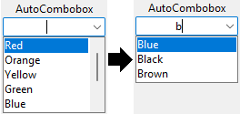

# AutoCombobox

AutoCombobox is a Ttk widget based on the existing Combobox. It allows the user to write on the entry field, viewing at the same time some suggested option based on what the user writes. The suggestions are customizable through a function that can be defined by the developer.

## Installation

AutoCombobox can be installed from PyPI using the command `pip install autocombobox`.
It doesn't have any dependences other than Tkinter.

## Usage

AutoCombobox was created specifically to be used like the normal Ttk Combobox, so all its options are available.
Beside that, it can accept the `filter` option, that allows the developer to pass the function that determines the suggestions. The function must take 2 parameters: the first represent the list of all possible options of the Combobox, and the second represent the text written on the entry field; the function must returns a list of integers rappresenting the indices of the position of each option (a negative value indicates that the option will not be shown). There is a default filter function, that shows all the options that starts with the user input.

AutoCombobox makes available also various useful methods:
- `show_listbox` and `hide_listbox` are the functions that manage the list of the Combobox options;
- `update_values` takes an optional string and filters the list of all possible values based on it, to show only suggestions. If no strings is given, it is taken from the entry field;
- `select` takes a string, and set the entry field with that. If the string is also in the possible value, it generate a `<<ComboboxSelected>>` event;
- `change_highlight` takes the index of the option we want to highglights.
